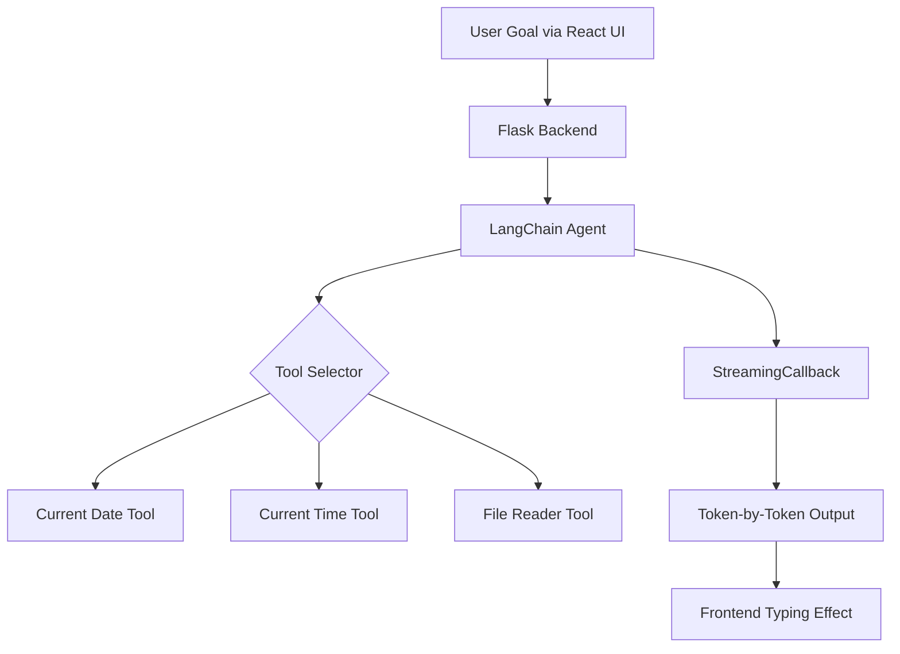

# 🎯 Goal-Oriented Task Agent
* A locally hosted agentic AI that converts high-level goals into actionable checklists by reasoning step-by-step, using real-time tools, and streaming its internal thoughts to a responsive frontend.
* Built using **LangChain**, **React**, **Flask**, and powered by **Mistral** via **Ollama**.
  
---

## 🚀 Demo


> _“Thought → Action → Observation” streamed live as the agent thinks out loud!_

---

## 🧠 Agent Architecture


---

## Tools
| Tool Name           | Purpose                                                             |
|---------------------|---------------------------------------------------------------------|
| Current Date Tool   | Returns the current system date in `YYYY-MM-DD` format              |
| Current Time Tool   | Returns the current system time in `HH:MM:SS` format                |
| File Reader Tool    | Reads and returns the contents of `sample_data.txt` for context     |

---

## Agent Behavior
* Uses LangChain's MRKL Agent with memory and retry support
* Follows structured reasoning: Thought → Action → Observation → Final Answer
* Recovers gracefully from parser errors with handle_parsing_errors=True
* Capped loop retries via max_iterations=6 for speed and stability

---

## Features
* Local LLM integration via Mistral + Ollama
* Custom tools and streaming callbacks
* Responsive React frontend with line-by-line typing effect
* Frontend and backend fully decoupled
* Uses all tools during run (validated)

---
## Sample Run Artifacts

| File Name                 | Description                                                             |
|---------------------------|-------------------------------------------------------------------------|
| `agent_output.txt`        | Final streamed checklist generated by the agent                         |
| `agent_trace.log`         | Backend terminal logs capturing Thought → Action → Observation steps    |
| `agent_config.md`         | Current agent configuration including model, tools, and prompt setup    |
| `screenshot_output.jpg`   | Final output rendered on the browser                                    |

---

## Run Locally

### 1. Backend
```bash
cd backend/
pip install -r requirements.txt
ollama run mistral
python app.py
```

### 2. Frontend
```bash
cd frontend/
npm install
npm start
```
---

## Tech Stack
| Technology             | Role                                   | Version / Details                    |
|------------------------|----------------------------------------|--------------------------------------|
| 🧠 LangChain          | Agent framework, tool chaining         | `langchain==0.1.x`                    |
| 💬 Mistral via Ollama | Local LLM for reasoning & generation   | `ollama run mistral`                  |
| 🐍 Flask              | Backend API & streaming agent output   | `flask==2.3.x`                        |
| ⚛️ React              | Frontend UI with typing effect         | `react==18.2.0`                       |
| 🧰 LangChain Tools    | Custom tools (Date, Time, FileReader)  | Defined in `tools.py`                 |
| 🧠 StreamingCallback  | Streams LLM output tokens in real-time | Defined in `streaming_callback.py`    |
| 🧠 LangChain Memory   | Retains agent history context          | `ConversationBufferMemory`            |

---

## Dependencies Installation
```bash
# Python
pip freeze > requirements.txt

# Node
npm list --depth=0
```
---
## Suggested Test Prompt

```text
Using today’s date, current time, and sample_data.txt, provide a short checklist for 3 family emergencies. Respond in under 100 words and conclude with Final Answer.
```
This input ensures all tools are used and the agent responds within ~3 minutes.

---
## Author
Built by Mithun Mudalagiriyappa — a methodical and resourceful developer focused on building impactful AI solutions.
